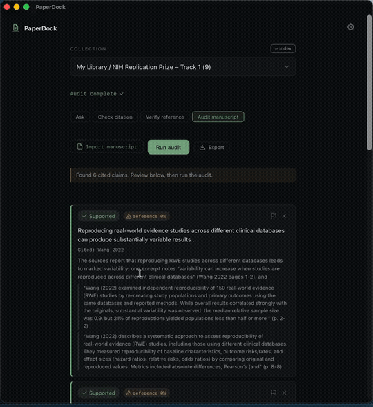

# PaperDock

**[English → README.md](README.md)**

针对你 Zotero 里的论文提问,得到**带引用**的答案,点引用即可在 Zotero 里打开原文
PDF。全程在你的 Mac 本地运行,论文库不外传。开源(MIT)——自带你的 LLM(OpenAI、
本地 Ollama,或 UF NaviGator 这类网关),可选配一个共享向量库。

PaperDock 是一个 **Zotero 伴侣**,**不是**要替代任何成熟的商用论文阅读软件。它
*围绕你自己的知识库*(你已有的 Zotero 库)工作,提升科研效率:提问、核查论断、
核验引用真伪。(长期也许会做成 Zotero 插件——未定。见 [路线图](ROADMAP.md)。)

<p align="center"></p>

---

## 1. 安装

1. 从 [Releases](https://github.com/Chesterguan/PaperDock/releases) 下载最新的
   **`PaperDock_x.y.z_universal.dmg`**(同时支持 Apple Silicon 和 Intel Mac)。
2. 打开 DMG,把 **PaperDock** 拖进「应用程序」。
3. **首次打开要右键 PaperDock → 打开**(再点弹窗里的「打开」)。直接双击会被拦,因为
   app 没做代码签名——只有第一次需要这个右键动作。
4. 首次启动会做**一次性安装**(下载一个小的 Python 环境,约 1–2 分钟,需联网)。点
   **Set up now** 等它装完即可,只此一次。

---

## 2. 配置 Zotero(只需一次)—— 重要

PaperDock 通过 Zotero 的本地连接读取你的库。三个条件都要满足,**第 2 步最容易漏:**

1. **用 Zotero 7 或更新版本。** PaperDock 需要的本地连接在 Zotero 6 里不存在
   (在 *Zotero → 关于 Zotero* 查看版本)。
2. **打开本地连接。** 在 Zotero:**设置 → 高级 → 常规 →** 勾选
   **「允许本机上的其他应用程序与 Zotero 通信」**。不勾的话,PaperDock 会一直卡在
   *"Waiting for Zotero…"*。*(不需要登录 Zotero 账号——PaperDock 只读你的本地库。)*
3. **使用期间保持 Zotero 开着**,并确保要提问的论文**放在某个 collection 里**且
   **PDF 已下载**(没有 PDF 的论文读不了)。

**一秒自检:** Zotero 开着时,浏览器打开
`http://localhost:23119/api/users/0/items/top?limit=1`,有返回(哪怕是空)就说明
连接已开。

---

## 3. 使用

选一个 **collection**,再选模式:

- **Ask** —— 输入问题,回车,得到**带引用**的答案,点引用即可在 Zotero 里打开原文。
  追问会留在同一个对话里。
- **Check citation** —— 粘贴一句**论断**,PaperDock 判断这些论文是否支持它
  (**SUPPORTED / PARTIALLY / NOT SUPPORTED / INSUFFICIENT EVIDENCE**)并给出证据引用。
  可选只针对某一篇。
- **Verify reference** —— 粘贴一条**参考文献**,PaperDock 用 CrossRef 核验,标出可能
  是编造的引用。

---

## 配置 key(v0.2+)

PaperDock 不内置任何 key。实验室 **管理员** 配置一次后台并导出一个小小的
`.paperdock` 文件,其他人双击即可。

### 申请 key —— NaviGator(UF)手把手

如果你的实验室用 **UF NaviGator**(本文示例),每人约 2 分钟就能拿到自己的 key:

1. 打开 **https://api.ai.it.ufl.edu/ui**,用 **GatorLink** 登录。
2. 点 **Create New Key**,选团队(默认 `navigator-toolkit`)、给 key 起名(如
   `PaperDock`)、勾选要用的模型——至少一个对话模型(`gpt-oss-120b`)和一个嵌入模型
   (`nomic-embed-text-v1.5`),点 **Create Key**。
3. **当场复制 key** —— 只显示一次。每位 UF 师生每月有 **$100** 额度(月初重置)。
4. 在 PaperDock → **⚙ 设置** 里填:
   - **API base:** `https://api.ai.it.ufl.edu/v1`
   - **Model:** `openai/gpt-oss-120b` · **Embedding:** `openai/nomic-embed-text-v1.5`
     (`openai/` 前缀告诉 PaperDock 走 NaviGator 的 OpenAI 兼容接口)
   - **LLM key:** 刚复制的 key

   点 **Save**,配置完成。

> 需要**共享团队预算**或超出个人 $100/月 的云模型?管理员可通过 **UFIT Help Desk
> Portal** 申请团队。模型列表:<https://docs.ai.it.ufl.edu/docs/navigator_models/>。

**不在 UF?** 同样三个字段换成任意提供商——OpenAI(在
<https://platform.openai.com> 拿 key,base 留空,model `gpt-4o`),或本地 **Ollama**
(不需要 key,base `http://localhost:11434`,model `ollama/llama3.1`)。

### 管理员 —— 配置一次

1. 打开 **⚙ 设置**,填好 Model / Embedding / API base / LLM key(可选 Qdrant URL+key
   做共享向量库,留空则每人本地嵌入)。
2. 点 **Export lab config…**。勾着 **"Include LLM key"** 给成员零配置文件;想让成员用
   各自的 key 就取消勾选。
3. **私下**分发生成的 `.paperdock` 文件(邮件/私聊给指定的人)—— 里面有你的 key。

### 成员 —— 加入实验室

1. 安装 PaperDock(见上面的安装)。
2. **双击**管理员发的 `.paperdock` 文件—— app 自动配置好并显示 "Lab config imported ✓"。
   (或在首启界面 / 设置里用 **Import lab config…**。)
3. 如果实验室用个人 key,自己申请一个(见上面的「申请 key」)填进 **⚙ 设置**。

### 共享团队库

共享向量库按 **Zotero 群组库** 划分。想和实验室共享嵌入,就在 Zotero 里加入那个群组
(Zotero → 你的账号 → Groups)。个人库的论文永远只在你**本机**嵌入。

> **安全提示:** `.paperdock` 文件和任何 API key 都是机密。拿到的人能用你的 LLM 额度、
> 读写你的共享向量库。只发给你信任的人,别公开、别提交进 git。

---

## 排障

| 你看到… | 处理 |
|---|---|
| **"Waiting for Zotero…"**(一直不消失) | Zotero 没开、不是 7+、或上面第 2 步那个「允许其他应用通信」没勾。 |
| **"no Zotero collections found"** | 库/collection 是空的——先在 Zotero 里往 collection 加论文。 |
| **"…papers have no PDF downloaded"** | 在 Zotero 里下载/同步这些论文的 PDF,再提问。 |
| macOS 提示 app **「已损坏」/ 无法打开** | 右键 app → **打开**(没签名而已,不是真损坏)。 |
| 安装界面 **报错** | 检查网络后点 **Try again**——首启需要联网下载依赖。 |

---

## 从源码构建

需要 Rust(含 `wasm32-unknown-unknown` target)、[Trunk](https://trunkrs.dev/) 和
[Tauri CLI](https://tauri.app/)。Python 那部分首启自动拉取。

```bash
rustup target add wasm32-unknown-unknown
cargo install trunk
npx @tauri-apps/cli dev      # 运行;打包用 `build`
```

## 路线图

见 [ROADMAP.md](ROADMAP.md)。

## 参与贡献

欢迎 issue 和 PR——见 [CONTRIBUTING.md](CONTRIBUTING.md)。PaperDock 是围绕
[PaperQA](https://github.com/Future-House/paper-qa) 的一层轻量原生外壳,大多数改动
落在 Rust/Leptos 前端(`src/`、`src-tauri/`)或 Python sidecar
(`sidecar/paperdock_worker.py`)。

## 致谢

**Ziyuan (Chester) Guan** 的个人项目,得到
**[UF IC3 Center](https://ic3.center.ufl.edu/)**(Intelligent Clinical Care Center)
与 **[PRISMAP Lab](https://prismap.medicine.ufl.edu/)** 相关人员的支持。检索与回答由
[PaperQA](https://github.com/Future-House/paper-qa) 驱动。

## 许可证

[MIT](LICENSE) © 2026 Ziyuan Guan
